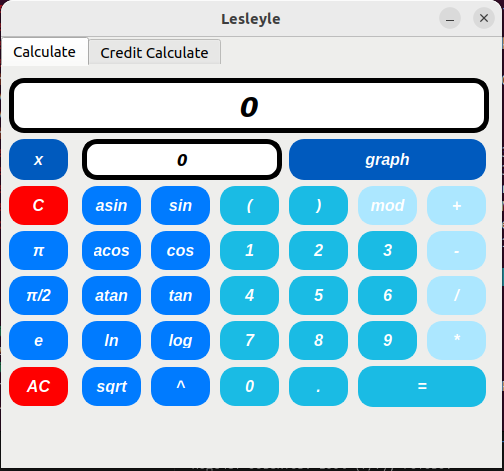
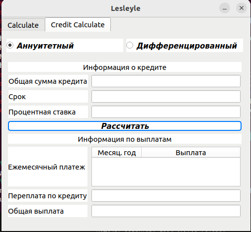
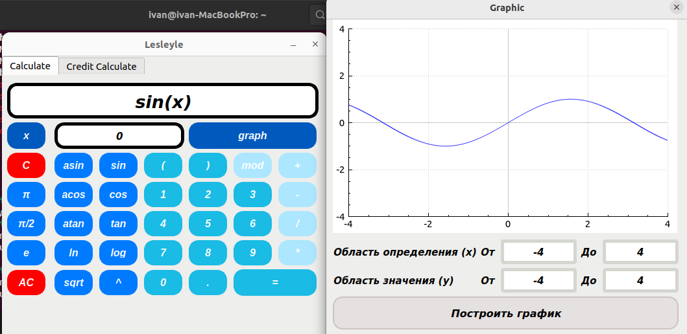

# SmartCalc

## Реализация SmartCalc

В данном проекте была реализована программа SmartCalc (калькулятор):

## Отчет о проделанной работе

### Общая информация
Программа разработана на языке программирования C стандарта C11 с использованием компилятора gcc. Для реализации графического пользовательского интерфейса (GUI) использовалась библиотека Qt

### Структура проекта
- **Код программы**: Весь исходный код программы размещен в папке `src`.
- **Сборка программы**: Настроена с помощью Makefile, который включает стандартный набор целей для GNU-программ: `all`, `install`, `uninstall`, `clean`, `dvi`, `dist`, `test`, `gcov_report`. Установка программы может производиться в любой указанный каталог.

### Принципы разработки
- **Структурное программирование**: Программа разработана в соответствии с принципами структурного программирования, что способствует её ясности, простоте и поддерживаемости.
- **Стиль кодирования**: При написании кода использовался стиль кодирования Google Style, обеспечивающий единообразие и читабельность кода.

### Тестирование
- **Unit-тесты**: Были написаны и покрыты unit-тестами все модули, связанные с вычислением выражений, с использованием библиотеки Check. Это гарантирует корректность и стабильность работы вычислительных модулей.

### Графический пользовательский интерфейс (GUI)
- **Реализация GUI**: Программа снабжена графическим интерфейсом на базе библиотеки Qt, что обеспечивает кроссплатформенность и высокую функциональность.

### Функциональные возможности
1. **Ввод данных**:
   - Поддерживается ввод как целых чисел, так и вещественных чисел, записанных через точку.
   - Обеспечена возможность обработки ввода чисел в экспоненциальной записи (опционально).

2. **Вычисления**:
   - Вычисление производится после полного ввода выражения и нажатия на символ `=`.
   - Поддерживаются произвольные скобочные арифметические выражения в инфиксной нотации.
   - Реализовано вычисление выражений с подстановкой значения переменной _x_ в виде числа.

3. **Построение графиков**:
   - Программа может строить графики функций, заданных в инфиксной нотации с переменной _x_.
   - Графики содержат координатные оси, отметку используемого масштаба и сетку с адаптивным шагом.
   - Не предоставляется возможность менять масштаб пользователю, что упрощает использование.
   - Область определения и область значения функций ограничены числами от -1000000 до 1000000.
   - Для построения графиков необходимо указывать отображаемые область определения и область значения.

4. **Точность и ограничения**:
   - Проверяемая точность дробной части — минимум 7 знаков после запятой.
   - Пользователю предоставляется возможность ввода до 255 символов.
   - Поддерживаются следующие арифметические операции и математические функции в инфиксной нотации.

    - **Арифметические операторы**:

        | Название оператора | Инфиксная нотация   (Классическая) | Префиксная нотация   (Польская нотация) |  Постфиксная нотация   (Обратная польская нотация) |
        | ------ | ------ | ------ | ------ |
        | Скобки | (a + b) | (+ a b) | a b + |
        | Сложение | a + b | + a b | a b + |
        | Вычитание | a - b | - a b | a b - |
        | Умножение | a * b | * a b | a b * |
        | Деление | a / b | / a b | a b \ |
        | Возведение в степень | a ^ b | ^ a b | a b ^ |
        | Остаток от деления | a mod b | mod a b | a b mod |
        | Унарный плюс | +a | +a | a+ |
        | Унарный минус | -a | -a | a- |

    - **Функции**:
  
        | Описание функции | Функция |   
        | ---------------- | ------- |  
        | Вычисляет косинус | cos(x) |   
        | Вычисляет синус | sin(x) |  
        | Вычисляет тангенс | tan(x) |  
        | Вычисляет арккосинус | acos(x) | 
        | Вычисляет арксинус | asin(x) | 
        | Вычисляет арктангенс | atan(x) |
        | Вычисляет квадратный корень | sqrt(x) |
        | Вычисляет натуральный логарифм | ln(x) | 
        | Вычисляет десятичный логарифм | log(x) |

## Дополнительно. Кредитный калькулятор
В программу добавлен специальный режим «кредитный калькулятор». Реализованы следующие возможности:
- **Входные данные**:
  - Общая сумма кредита.
  - Срок кредита.
  - Процентная ставка.
  - Тип кредита (аннуитетный или дифференцированный).
- **Выходные данные**:
  - Ежемесячный платеж.
  - Переплата по кредиту.
  - Общая выплата.

## Скриншоты из программы: 

*Главное меню*

*Кредитный калькулятор*

*Меню построения графика*

### Заключение
Программа обладает всеми необходимыми функциональными возможностями, включая удобный графический интерфейс и поддержку широкого диапазона математических вычислений и построения графиков. Дополнительно реализованы функции кредитного калькулятора, что расширяет функциональные возможности программы и делает её полезной для более широкого круга пользователей.
