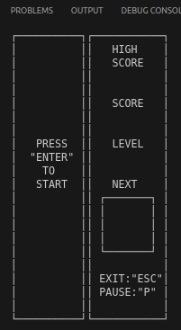
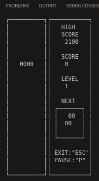
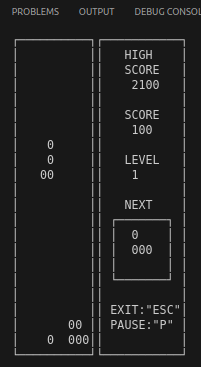

# BrickGame Тетрис

## Общая информация

Программа BrickGame v1.0 (Тетрис) разработана на языке программирования C стандарта C11 с использованием компилятора gcc. Программа состоит из двух частей: библиотеки, реализующей логику игры Тетрис, и терминального интерфейса с использованием библиотеки `ncurses`.

## Структура проекта

- **Логика игры**:
  - Код библиотеки, реализующей логику игры Тетрис, находится в папке `src/brick_game/tetris`.
- **Интерфейс программы**:
  - Код с терминальным интерфейсом программы находится в папке `src/gui/cli`.
- **Сборка программы**:
  - Настроена с помощью Makefile, который включает стандартный набор целей для GNU-программ: `all`, `install`, `uninstall`, `clean`, `dvi`, `dist`, `test`, `gcov_report`. Установка программы может производиться в любой указанный каталог.

## Принципы разработки

- **Структурное программирование**:
  - Программа разработана в соответствии с принципами структурного программирования, что способствует её ясности, простоте и поддерживаемости.
- **Стиль кодирования**:
  - При написании кода использовался стиль кодирования Google Style, обеспечивающий единообразие и читабельность кода.

## Тестирование

- **Unit-тесты**:
  - Были написаны и покрыты unit-тестами все модули библиотеки с использованием библиотеки `check`. Тесты успешно проходят на ОС Darwin и Ubuntu.
  - Покрытие библиотеки с логикой игры тестами составляет не менее 80 процентов, что гарантирует стабильность и корректность работы программы.

## Реализация игрового процесса

- **Механики игры**:
  - Вращение фигур.
  - Перемещение фигуры по горизонтали.
  - Ускорение падения фигуры (при нажатии кнопки фигура перемещается до конца вниз).
  - Показ следующей фигуры.
  - Уничтожение заполненных линий.
  - Завершение игры при достижении верхней границы игрового поля.
  - Поддержка всех видов фигур, которые реализованы в классическом тетрисе.

- **Управление**:
  - Начало игры.
  - Пауза.
  - Завершение игры.
  - Стрелка влево — движение фигуры влево.
  - Стрелка вправо — движение фигуры вправо.
  - Стрелка вниз — падение фигуры.
  - Стрелка вверх — не используется в данной игре.
  - Действие (вращение фигуры).

- **Игровое поле**:
  - Соответствует размерам игрового поля консоли — десять «пикселей» в ширину и двадцать «пикселей» в высоту.
  - Фигура, после достижения нижней границы поля или соприкосновения с другой фигурой, останавливается. После этого происходит генерация следующей фигуры, показанной на превью.
  
- **Конечный автомат**:
  - Логика игры формализована с использованием конечного автомата (КА).
  - Подготовлена диаграмма, описывающая состояния и возможные переходы конечного автомата.

## Интерфейс библиотеки

- **Описание интерфейса библиотеки**:
  - Соответствует описанию, приведенному в materials/library-specification_RUS.md.
  - Библиотека содержит функцию, принимающую на вход ввод пользователя, и функцию, выдающую матрицу, описывающую текущее состояние игрового поля при каждом её изменении.

- **Пользовательский интерфейс**:
  - Поддерживает отрисовку игрового поля и дополнительной информации.

## Механики

- **Подсчет очков**:
  - Поддерживается подсчет очков в зависимости от количества уничтоженных линий:
    - 1 линия — 100 очков.
    - 2 линии — 300 очков.
    - 3 линии — 700 очков.
    - 4 линии — 1500 очков.

- **Хранение рекорда**:
  - Хранение максимального количества очков.
  - Информация о текущих очках и рекорде выводится в боковой панели пользовательского интерфейса.
  - Максимальное количество очков хранится в файле и сохраняется между запусками программы.
  - Максимальное количество очков обновляется в режиме реального времени, если текущий показатель превышает предыдущий рекорд.

## Механики уровней

- **Уровни**:
  - Введение механики уровней: при наборе 600 очков уровень увеличивается на 1.
  - Повышение уровня увеличивает скорость движения фигур.
  - Максимальное количество уровней — 10.

## Скриншоты из программы: 

*Главное меню*

*Процесс игры*

*Удаление заполненной строки и увеличени счета*

## Заключение

Программа BrickGame v1.0 (Тетрис) соответствует стандартам и обладает всеми необходимыми функциональными возможностями, включая удобный терминальный интерфейс, поддержку широкого диапазона игровых механик, подсчет очков, хранение рекордов и механику уровней.
